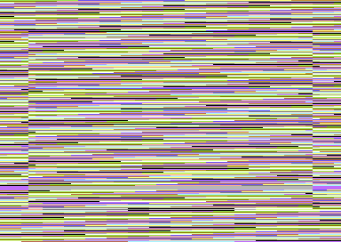

# Divertirsi con il tuo Commodore 64

## Screen Player

Giocare con lo schermo: questo programma ripulisce il contenuto dello schermo e cambia i colori di bordo e sfondo.



### Versione Assembler

```asm
; Screen Player
; clear screen content and play with border and
; background colors

; daniele.olmisani@gmail.com


; jump location of BASIC RUN command
*=$0801

; 10 SYS (2064)

        BYTE    $0E, $08, $0A, $00, $9E, $20, $28, $32
        BYTE    $30, $36, $34, $29, $00, $00, $00

; start of program at $0810

;       jsr $E544   ; clear screen kernal routine

; otherwise implemet a clear loop

        lda #$20    ; space screen code
        ldx #$00    ; starting index

clear   sta $0400,x ; clear 256 bytes of screen memory
        sta $0500,x 
        sta $0600,x
        sta $06E8,x ; a short overlap in order to avoid
                    ; more complex loop

        inx         ; increment X
  
        bne clear   ; loop until X will overflow to zero

BORDER = $D020
SCREEN = $D021

start   inc SCREEN  ; increase screen colour 
        inc BORDER  ; increase border colour
        jmp start   ; repeat
```

### Versione Basic
Questa versione del programma può essere inserita ed eseguita direttamente sul C64.

```
100 REM SCREEN PLAYER
110 SA = 2049
120 FOR N = 0 TO 42
130 READ A% : POKE SA+N,A%: NEXT N
140 SYS SA
150 END 
160 DATA 14,8,10,0,158,32,40,50
170 DATA 48,54,52,41,0,0,0,169
180 DATA 32,162,0,157,0,4,157,0
190 DATA 5,157,0,6,157,232,6,232
200 DATA 208,241,238,33,208,238,32,208
210 DATA 76,35,8
```
